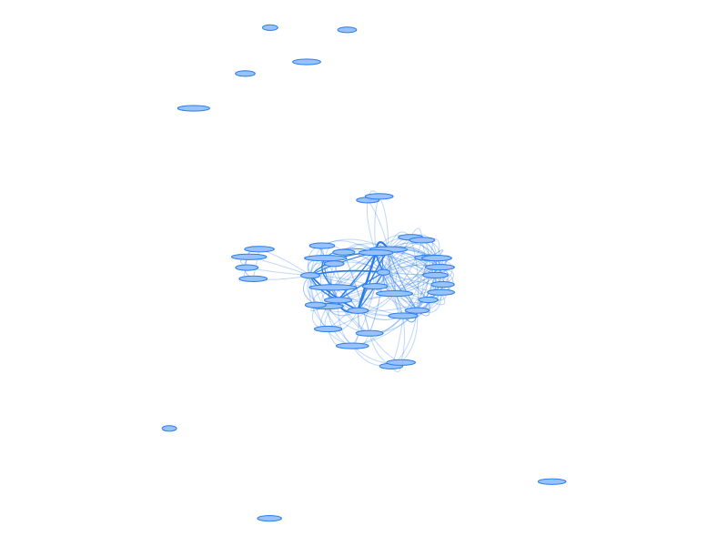
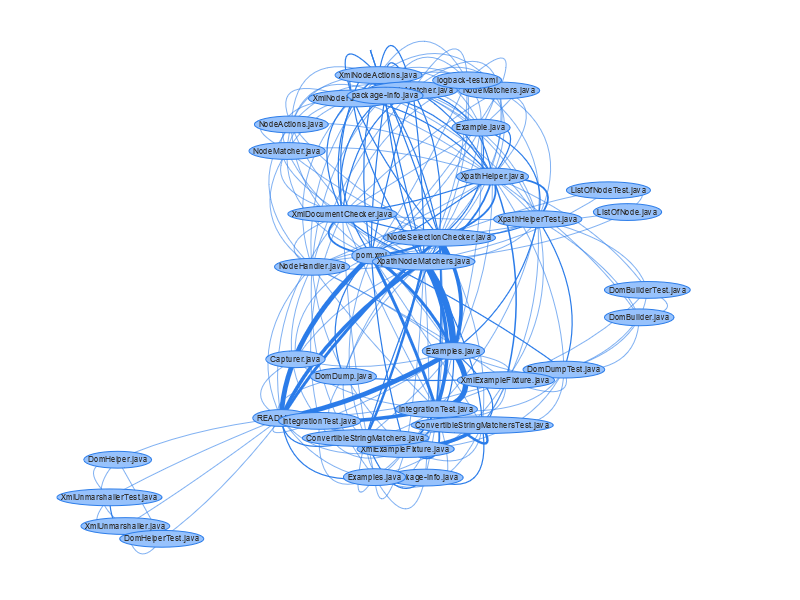

Experiments using `icm-dpickx`
==============================

Capture some experiments using the
[`icm-dpickx`](https://github.com/ayeseeem/icm-dpickx)
code base.

The git log
[`code-maat--log--reversed.txt`](../code-maat--log--reversed.txt)
was created from commit
[94dd9c0](https://github.com/ayeseeem/icm-dpickx/commit/94dd9c0),
which is the next commit after
[6fd277e](https://github.com/ayeseeem/icm-dpickx/commit/6fd277e).

The command was

```bash
git log --reverse --all --numstat --date=short --pretty=format:'--%h--%ad--%aN' --no-renames > code-maat--log.txt
```

- Graph including
  [unconnected nodes](icm-dpickx--with-unconnecteds--seed2.png) (seed = 2):
  
- Graph excluding
  [unconnected nodes](icm-dpickx--no-unconnecteds--seed2.png) (seed = 2):
  
